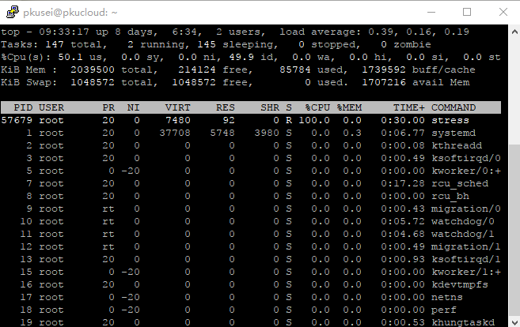
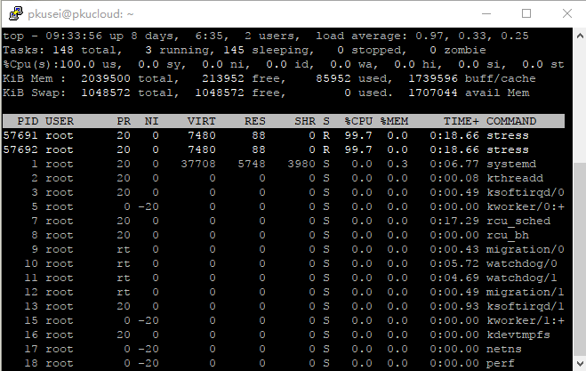
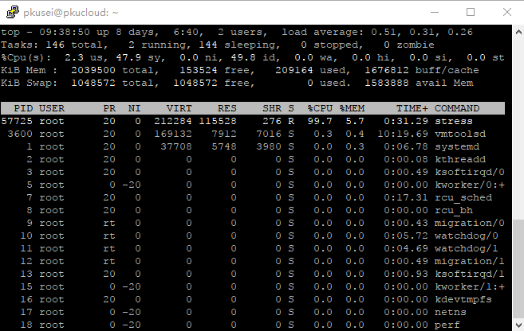
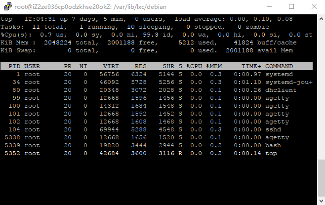

# 第二次作业

## 说明任意linux发行版的roofs制作流程

阅读的是[lxc-Debian](./src/lxc-debian)

#### install_debian

首先检查缓存文件夹中是否有这个发行版, 如果没有, 就下载一个新的.

将下载/缓存好的发行版文件复制到目标文件夹.

#### configure_debian

首先检测各个设备是否存在, 没有就创建设备文件.

配置/etc/inittab

将/proc/self/mtab映射到rootfs/etc/mtab

配置网络接口, hostname

配置系统语言

生成新的ssh key, 配置dpkg

设置时区

#### copy_configuration

确保有一个hwaddr, 把容器的配置信息写到rootfs外的配置文件里面.

#### configure_debian_systemd

配置systemd, 主要在处理各个设备的配置

#### post_process

检查架构, 如果和宿主不一样, 安装一个新的架构

把架构之类的信息写到rootfs/etc/apt/里面.

在容器内安装一些包

#### 善后工作

有必要的话, 清掉cache中的文件

## 完善代码, 压力测试, 讨论

#### 代码

增加了限制内存的代码

```c
// TODO:添加cgroup memory子系统，设置内存上限为512MB ==> DONE
/*  Time:      03/14  11:19
 *  reference: https://www.kernel.org/doc/Documentation/cgroup-v1/memory.txt
 *             http://libcg.sourceforge.net/html/index.html
 *  tested, and works.
 */
struct cgroup_controller *cgc_memory = cgroup_add_controller(cgroup, "memory");
if(  !cgc_memory ){
    /* what's ECGINVAL?
     * Represents error coming from other libraries like glibc.
     * reference: http://libcg.sourceforge.net/html/group__group__errors.html
     */
    ret = ECGINVAL;
    printf("Error add controller %s\n", cgroup_strerror(ret));
    goto out;
}
/* should i choose this function? ==> yes, at least it works. */
if(  cgroup_add_value_int64(cgc_memory, "memory.limit_in_bytes", MEMORY_LIMIT)){
    printf("Error limit memory.\n");
    goto out;
}
```

修改cpu为1核心只需要把"0-1"改成"0".

完整的代码[链接](./src/fakeContainer.c)

#### 压力测试

###### cpu 1核


修改cpu部分的代码, 发现容器确实只使用了一个核

###### cpu 2核



单进程, 只使用一个核



多进程, 使用了两个核, 因为这台机器只有两个核, 再测试下去似乎看不出是否限制成功

###### mem 512m



使用200m内存, 没有达到内存限制, 容器照常运行


使用达到内存限制, 发现此时占用宿主机的~25%内存


超过内存限制, 容器照常运行, 仍只占用约25%的内存.

#### 讨论

cgroup文档中描述的是, 如果内存使用超过设定的限制, 会先执行回收程序(使用LRU)尝试回收内存, 如果失败的话, 则占用内存最高的程序会被杀死

用stress中内存压力测试是不断分配内存写'z', 至少这次实验没有出现程序被杀死的情况

```c
int
hogvm (long long bytes, long long stride, long long hang, int keep)
{
    long long i;
    char* ptr = 0;
    char c;
    int do_malloc = 1;

    while (1)
    {
        if (do_malloc)
        {
            dbg (stdout, "allocating %lli bytes ...\n", bytes);
            if (!(ptr = (char *) malloc (bytes * sizeof (char))))
            {
                err (stderr, "hogvm malloc failed: %s\n", strerror (errno));
                return 1;
            }
            if (keep)
            do_malloc = 0;
        }

        /* 略去一些写z的代码 */

        for (i = 0; i < bytes; i += stride)
        {
            c = ptr[i];
            if (c != 'Z')
            {
                err (stderr, "memory corruption at: %p\n", ptr + i);
                return 1;
            }
        }
    return 0;
}
```

文档中描述了当内存限制很小的时候,  会出现程序被杀死的情况, 但是还没有复现

事实上内存限制到1m也可以跑....

推测这时利用了swap区域, 事实上swap利用率确实上升了


stress程序运行之后, 发现swap利用的大小趋近800m

[cgroup-v1文档](https://www.kernel.org/doc/Documentation/cgroup-v1/memory.txt)
中提到"memory.memsw.limit_in_bytes"可以限制mem + swap的空间, 但是这个api已经没有了.

[cgroup-v2文档](https://www.kernel.org/doc/Documentation/cgroup-v2.txt)中可以直接操作swap空间.

## lab1代码的完善

#### 健壮性

lab1的初始代码中没有考虑很多可能失败的地方(比方说创建/启动/调用容器失败),而这些地方在lab1的代码中都没有考虑, 至少也可以输出错误信息.

#### 访问容器

lxc访问容器可以通过lxc-attach, lxc-console来访问容器

但是lab1中只涉及把硬编码的函数调给容器, 既不能访问容器的shell(但利用python api是可以做到的), 也没有涉及传递个性化的参数和函数, 这是可以加以改进的地方.

#### 资源隔离

lab1的代码并没有设置资源的限制, 理论上容器运行的程序可以耗尽宿主机的内存等资源

所以可能需要添加代码来限制容器能使用的内存, cpu数量和网络等其他的资源.

#### 没有完全解决的问题

pid: lab2中, "容器"(fakeContainer)的1号进程是bash, 宿主机的1号进程是systemd


而lab1中容器(也就是lxc容器)1号进程是systemd



如果作业中的"lab 1"指的是"第一次作业"的话, 这一点上似乎不用改进, 因为它本身基于lxc

而若是"第二次作业"的话, 可能要考虑需求(比如说需要容器隔离健壮, 或者需要容器简单轻便)来决定是否需要在容器中构建比较完整的进程结构.

网络栈: 在lxc-debian中提到了"dhcp"...(但是不是很懂), lab 1中的容器应该和lxc一致, 当然lab 2的容器还不能访问网络...

###### last modified date: 03/24
