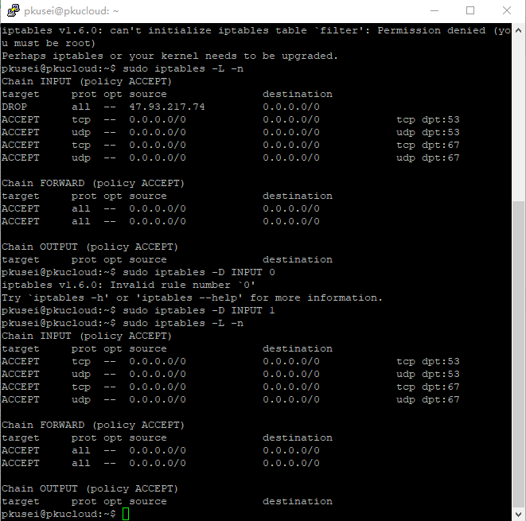
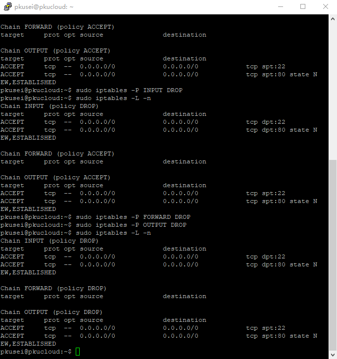
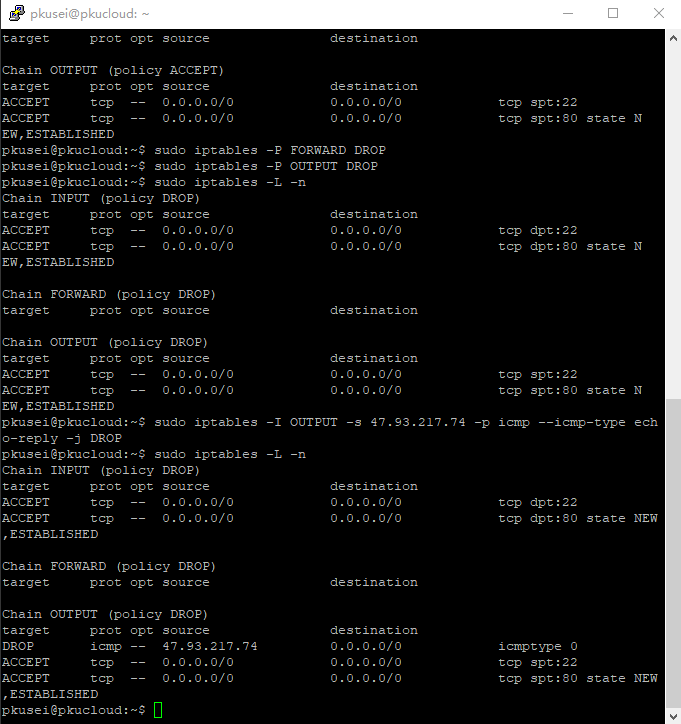

# 第三次作业

### 叙述linux网络包处理流程(__亟须确认!!!__)

首先考虑本机收到的网络包, 它们会经历下面的过程

 - raw: 检查这个包的状态: 比如说是之前某一个连接的包, 还是属于一个新的连接的包
 - connection tracking: 存储连接的状态, 它本身似乎不会过滤网络包
 - mangle: 对包进行可能的修改, 比如修改包头的数据
 - nat: 转发网络包, 有的会转发到网桥(_可能是错的_)

之后的数据包有两种流向,

 - 被本机接受的包
    - mangle: 有必要的话对包进行修改
    - filter: 过滤网络包, 有必要的话拦截它
 - 被转发出去的包
    - mangle: 同上, 进行必要的修改
    - filter: 过滤网络包, 之后它们和本机发出去的包汇合

之后考虑本机想发出去的包, 它们会经历类似的过程

 - raw, connection tracking, mangle: 和上面描述的过程大致类似
 - nat: 这里的nat可能和bridge有关
 - filter: 同上, 进行一些过滤操作, 可以通过的包之后和转发的包回合
 - mangle: 必要情况下修改包
 - nat: 转发到网络中去

###### 参考

 [解释connection tracking的一个网站](http://wiki.netfilter.org/pablo/docs/login.pdf)
 [讲义原图的网站](https://www.booleanworld.com/depth-guide-iptables-linux-firewall/)
 [比较详细解释过程的图片](https://mikrotik.com/testdocs/ros/2.9/img/packet_flow31.jpg)

### 使用iptables实现一些功能

##### 拒绝ip访问(_这是成功了?_)

##### 只开放http, ssh, 拒绝其他端口, 服务(_这是成功了?_)

##### 拒绝回应一个ip的ping(_问题是...本来也ping不通..._)

### 解释区别, 工作原理

##### 路由和交换的区别(_我觉得全是错的, 网络根本不会_)

| 属性 | 路由 | 交换 |
| - | :-: | -: |
| 层级 | 主要第三层, 针对ip | 主要第二层, 针对mac |
|  |  |  |  

##### 路由和交换的区别
