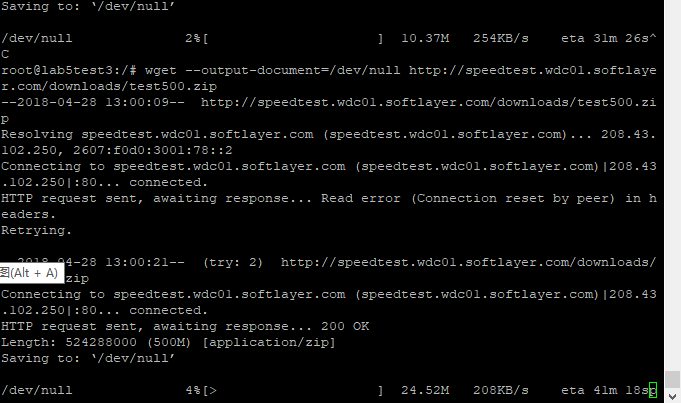

# 第四次作业

### 叙述以下的容器通信的处理

#### 同一子网的不同容器

因为处于同一子网, 容器向所有人发arp报文(但是没看到啊...), 向目的地址发送数据

下面分别是ping同一子网容器和ping外网的结果, 在访问外网的过程中可以看到可以看到arp(?似乎有点问题的)


#### 同一host不同子网的两容器

不同子网的容器理应是不相通的, 但这里因为网关相通, 所以能够绕道网关互相访问

容器发送arp, 询问网关, 之后将数据发送到网关, 网关1将数据发到网关2, 网关2再将数据发到容器2

下面是ping不同子网容器的结果(container1 - ... - container2)

分别监听br0(gw0), br1(gw1), host的eth0


#### gre隧道相连的两host上的两容器

还需要接着做实验..

下面是实验的结果


### 叙述vlan, 解释用户数量限制

vlan是通过在数据包上添加包头来识别不同的子网, 共4字节, 其中12位用来标注VID, 0x000和0xFFF是保留的, 所以最多可以有4094个子网

交换机的各个端口上设有标签. 当接到一个需要转发的帧的时候, 交换机加上这个端口对应的标签, 只转发到标签相同的端口上面, 同时把标签去掉, 但如果是trunk转发到另一个交换机的话, 不会去掉标签, 由对端的交换机负责去标签

### 调研vxlan, 和gre比较

vxlan的包头有8字节, 用24位标识子网序号, 所以能够容纳更多的子网

比较....先鸽了


### 实现网络结构, 体显隔离性和相通性

下面分别是同组和不同组的容器ping的结果


### 限制流量

一种方法可以是

```
ovs-vsctl set Interface eth0 options:link_speed=200K
```

结果如下图, 上面的是限速之前, 下面的是限速之后, 网速大致在200K上下徘徊, 限制的并不紧, 而在speedtest-cli测速中完全失效



另一种方法是

```
ovs-vsctl -- set port lab5br1 qos=@newqos \
-- --id=@newqos create qos type=linux-htb other-config:max-rate=1000000 queues=0=@q0 \
-- --id=@q0 create queue other-config:min-rate=100000 other-config:max-rate=1000000


```

通过了speedtest-cli测试, 限制也不是很紧(或许是误差的因素)


###### 用于实验的网络结构(基于ip的子网只用于区分不同的实验)

```javascript
host1{
    lab5br0(172.16.0.1/24){ // 同一子网容器访问
        lab5test1(172.16.0.10)
        lab5test2(172.16.0.20)
    }
    lab5br1(172.16.1.1/24){ // 不同host同一子网容器访问, 和实现课上网络结构
        lab5test3(172.16.1.10)
        lab5test4(172.16.1.21)
    }
    lab5br3(172.16.3.1/24){ // 测试vxlan

    }
}

host2{
    lab5br2(172.16.1.2/24){ // 课上网络结构, test6和test4属于同一子网
        lab5test6(172.16.1.20)
    }
    lab5br4(172.16.3.2/24){ // 测试vxlan

    }
}
```
