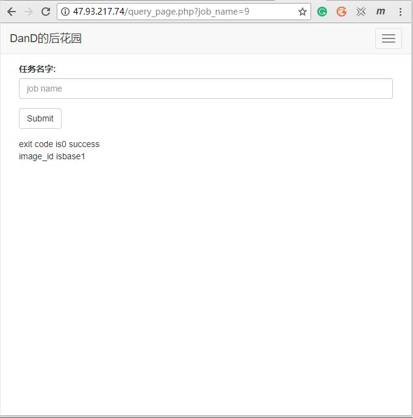

# 第六次作业

### 已实现的功能

- 用户自定义输入
    - 执行任务的命令行
    - 超时时间
    - 失败重试
    - 自主选择镜像
    - 输出文件重定向
- 可视化
    - 设计提交界面, 用户通过填写表格提交任务
    - 设计查询界面, 用户填写任务名称查询状态
- 任务管理
    - 通过维护状态文件, 查询管理任务状态

### 现行架构

用户同前端交互, 提交任务后, [php文件](./src/backend/action_page.php)执行[master进程](./src/backend/master/master.py), 通过rpc方式, 将任务分发给slave节点上的[deamon进程](./src/backend/slave/slave.py), 执行任务.

全过程中维护gfs上的/shareddata/job_name/status.txt, /shareddata/$job_name/config.txt, 并将输出重定向至/shareddata/job_name/out.txt

任务状态暂时通过读取/shareddata/job_name/status.txt实现, 初始化为-1, 表示还在pending, 退出码0为成功, 其他值表示失败

### 具体实现

#### 用户交互

[用户界面](http://47.93.217.74/oslab.html)

用户通过填写表格, 自定义任务


提交任务后, 跳转到提交界面(尚未完成)


[查询任务界面](http://47.93.217.74/status_query.html)

输入任务id, 跳转到结果界面



删除任务

这个真的还没写....

#### master节点上的实现

用户的操作都经由www-data(apache用户)代为执行

提交任务的代码

```php
// php

<?php
echo "now executing... python /var/www/master.py $job_name $cmd_line $max_retry_time $time_out $image_id $cpu_limit $mem_limit";

echo "<br>";

echo `python /var/www/master.py $job_name $cmd_line $max_retry_time $time_out $image_id $cpu_limit $mem_limit`;

echo "<br>";

?>
```

```python
# python

client = msgpackrpc.Client(msgpackrpc.Address("localhost", 8080))
client.call('run', sys.argv[1], sys.argv[2], sys.argv[3], sys.argv[4], sys.argv[5], sys.argv[6], sys.argv[7]);
```

query_page的实现如下(log文件权限755, 可以读不能写)

```php
// php

<?php
    $job_name = $_GET['job_name'];
    $job_path = '/var/www/shareddata/'.$job_name;
    if(is_dir($job_path)){
        $flie_name = '/var/www/shareddata/'.$job_name.'/status.txt';
        if(file_exists($flie_name)){
            $file_handle_code = fopen($flie_name, 'r');
            fscanf($file_handle_code, '%d\n', $status);
            echo 'exit code is';
            echo $status;
            echo '    ';
            if($status === 0){
                // 用户返回了0
                echo 'success';
            }else if($status === -1){
                // 用户没有返回零, 或者调用失败没有覆盖初始化的1
                echo 'unknown';
            }else{
                echo 'failed';
            }
            fclose($flie_name);
        }else{
            // 还没创建文件
            echo 'pending';
        }
        echo '<br>';
        $flie_name = '/var/www/shareddata/'.$job_name.'/config.txt';
        $file_handle_image = fopen($flie_name, 'r');
        $image_id = fgets($file_handle_image, 1024);
        echo 'image_id is';
        echo $image_id;
    }else{
        echo 'can not find its directory...';
    }
?>
```

#### slave节点的实现

slave端运行rpc的server准备接受调度到它的任务

```python
# python

# lxc 在本机不能用, 暂时通过shell实现

# 创建这个任务的文件夹
os.system("mkdir -p /var/www/shareddata/%s" % jobname);
print("mkdir -p /var/www/shareddata/%s" % jobname);

os.system("touch /var/www/shareddata/%s/out.txt" % jobname);
os.system("touch /var/www/shareddata/%s/config.txt" % jobname);
os.system("touch /var/www/shareddata/%s/status.txt" % jobname);

print("touch /var/www/shareddata/%s/out.txt" % jobname);
print("touch /var/www/shareddata/%s/config.txt" % jobname);
print("touch /var/www/shareddata/%s/status.txt" % jobname);

# 初始化
with open("/var/www/shareddata/%s/config.txt" % jobname, "w") as fp:
    print("writing config file...");
    fp.write(image_id);

with open("/var/www/shareddata/%s/status.txt" % jobname, "w") as fp:
    print("writing status file...");
    fp.write("-1");
    print("done");

# 启动容器, 限制资源
print("lxc-start -n %s" % image_id);
os.system("lxc-start -n %s" % image_id);
print("lxc-start -n %s" % image_id);

os.system("lxc-cgroup -n %s cpuset.cpus \"%s\" " % (image_id, cpu_limit) );
os.system("lxc-cgroup -n %s memory.limit_in_bytes \"%s\" " % (image_id, mem_limit) );
print("lxc-cgroup -n %s cpuset.cpus \"%s\" " % (image_id, cpu_limit) );
print("lxc-cgroup -n %s memory.limit_in_bytes \"%s\" " % (image_id, mem_limit) );

# 循环调用直至成功
print(max_retry_time);
if max_retry_time > 0:
    now_try_time = 0;
    while now_try_time < max_retry_time:
        now_try_time += 1;
        print("lxc-attach -n %s -- %s > /var/www/shareddata/%s/out.txt && echo 0 > /var/www/shareddata/%s/status.txt" % (image_id, cmd_line, jobname, jobname) );
        os.system("lxc-attach -n %s -- %s > /var/www/shareddata/%s/out.txt && echo 0 > /var/www/shareddata/%s/status.txt" % (image_id, cmd_line, jobname, jobname) );

        time.sleep(time_out);

        with open("/var/www/shareddata/%s/status.txt" % jobname, "r") as fp:
            status_now = fp.read();
            if status_now == 0:
                break;
return 0;

```

### 改进地方

- 容器应该在创建任务时构造镜像, 使用lab5的脚本, 但因为这台机器上aufs挂掉了, 实现上是只有有限个容器的(但是临时创建镜像的时间开销可能不小...)
- 如果只有有限台容器, 一台上面跑太多任务? ==> 锅丢给用户吧
- 除非用户主动删除任务, 现在不会主动删, 超时就删? 将来要支持起服务器(事实上在master-slave分离之前是可行的)
- 用户乱输数据怎么办?
- 逻辑问题: sleep 10 && echo hi!, 限时5s, 跑4次, 应该关容器吗? service nginx start呢? 执行成功是指成功调用还是成功返回? "用户的退出值"? 可能要看情况了, 这里还是把锅扔给用户...他去删任务, 关容器...有镜像就省事了...容器随便起
- 目前master和slave在同一个物理机上, 但没有逻辑的问题, 分开只需要改master的代码就行


### 进度

05-20 输入任务, [测试界面](http://47.93.217.74/oslab.html), [结果](http://47.93.217.74/out.txt)

### 测试

05-20

输入


php输出


cpp输出


05-25

镜像脚本不work了....惊了 ==> 因为我是智障...在Linux里用\\r...把/var/lib/lxc删了...

php提权? ==> 用sudo就行...

进程状态怎么办?

05-25

aufs用不了了....暂时不能随时创建镜像...

glusterfs & 输出重定向做完了...?

进程状态怎么办?

(这就不是master-slave架构的吧...但是不会http只能这样...或者把容器扔到gre对端...假装是slave)


05-28

用文件存状态, 输出, 退出码

加了一个querypage


restapi好像不能解决不会写daemon的问题...

端口映射到$host:1926

aufs用不了怎么办....之前镜像的容器也没有了...

05-31

rpc c++ 编译不了啊.... ==> python能用就行...

### 坑

创建任务的时候启动容器, 创建文件夹; 销毁任务的时候关闭容器, 删除文件夹

写文件之前先赋权

iptables用-A添加的规则用-D原封不动删掉

### 已知bug

 - 命令行有空格请务必用双引号包裹
 - 任务名不要中文编码(主要是txt那里的问题)
 - 一用aufs就死机...lxc就不能用...就要回档...还不知道回到哪一天...
 - 回档之后apache要重启
